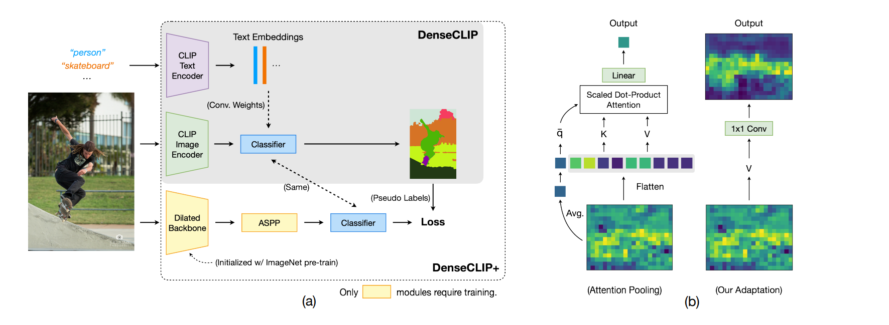
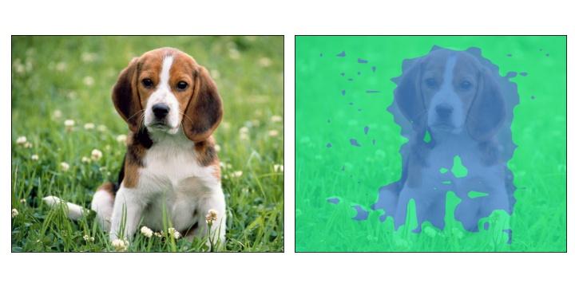

# MaskCLIP: Extract Free Dense Labels from CLIP

[[Project]](https://www.mmlab-ntu.com/project/maskclip/) [[Paper]](https://arxiv.org/abs/2112.01071) [[Model Card]](model-card.md) [[Colab]](https://colab.research.google.com/github/akanametov/maskclip/blob/master/notebooks/Interacting_with_MaskCLIP.ipynb)

## Abstract
<!-- [ABSTRACT] -->
Contrastive Language-Image Pre-training (CLIP) has made a remarkable breakthrough in open-vocabulary zero-shot image recognition. Many recent studies leverage the pre-trained CLIP models for image-level classification and manipulation. In this paper, we wish examine the intrinsic potential of CLIP for pixel-level dense prediction, specifically in semantic segmentation. To this end, with minimal modification, we show that MaskCLIP yields compelling segmentation results on open concepts across various datasets in the absence of annotations and fine-tuning. By adding pseudo labeling and self-training, MaskCLIP+ surpasses SOTA transductive zero-shot semantic segmentation methods by large margins, e.g., mIoUs of unseen classes on PASCAL VOC/PASCAL Context/COCO Stuff are improved from 35.6/20.7/30.3 to 86.1/66.7/54.7. We also test the robustness of MaskCLIP under input corruption and evaluate its capability in discriminating fine-grained objects and novel concepts. Our finding suggests that MaskCLIP can serve as a new reliable source of supervision for dense prediction tasks to achieve annotation-free segmentation.



## Results and models of annotation-free segmentation

#### Pascal VOC 2012 + Aug (w/o Background)

| Method    | CLIP Model | Crop Size | IoU(s) | IoU(u) | hIoU | mIoU |
| --------- | ---------- | --------- |------- |------- |----- |----- |
| MaskCLIP  | RN50x16    | 512x512   |  61.9  |  62.4  | 62.2 | 62.0 |
| MaskCLIP  | RN50x64    | 512x512   |  62.0  |  64.5  | 63.2 | 62.7 |
| MaskCLIP  | ViT-B/16   | 512x512   |  60.5  |  52.4  | 56.2 | 58.5 |
| MaskCLIP  | ViT-L/14   | 512x512   |  65.1  |  63.5  | 64.3 | 64.7 |


#### Pascal Context (w/o Background)

| Method    | CLIP Model | Crop Size | IoU(s) | IoU(u) | hIoU | mIoU |
| --------- | ---------- | --------- |------- |------- |----- |----- |
| MaskCLIP  | RN50x16    |  520x520  |  15.0  |  26.8  | 19.2 | 17.0 |
| MaskCLIP  | RN50x64    |  520x520  |  14.4  |  26.4  | 18.6 | 16.4 |
| MaskCLIP  | ViT-B/16   |  520x520  |  20.4  |  35.3  | 25.8 | 22.9 |
| MaskCLIP  | ViT-L/14   |  520x520  |  19.8  |  33.5  | 24.9 | 22.1 |


#### COCO-Stuff 164k

| Method    | CLIP Model | Crop Size | IoU(s) | IoU(u) | hIoU | mIoU |
| --------- | ---------- | --------- |------- |------- |----- |----- |
| MaskCLIP  | RN50x16    | 512x512   |  11.0  |  11.3  | 11.2 | 11.0 |
| MaskCLIP  | RN50x64    | 512x512   |  11.0  |  10.9  | 11.0 | 11.0 |
| MaskCLIP  | ViT-B/16   | 512x512   |  14.0  |  23.0  | 17.4 | 14.8 |
| MaskCLIP  | ViT-L/14   | 512x512   |  14.4  |  22.2  | 17.5 | 15.1 |

## Example



## Usage

First, [install PyTorch 1.7.1](https://pytorch.org/get-started/locally/) (or later) and torchvision, as well as small additional dependencies, and then install this repo as a Python package. On a CUDA GPU machine, the following will do the trick:

```bash
$ conda install --yes -c pytorch pytorch=1.7.1 torchvision cudatoolkit=11.0
$ pip install ftfy regex tqdm
$ pip install git+https://github.com/akanametov/MaskCLIP.git
```

Replace `cudatoolkit=11.0` above with the appropriate CUDA version on your machine or `cpuonly` when installing on a machine without a GPU.

```python
import torch
import maskclip
from PIL import Image
from matplotlib import pyplot as plt

device = "cuda" if torch.cuda.is_available() else "cpu"
model, preprocess = maskclip.load("RN50", device=device)

image = preprocess(Image.open("notebooks/dog.jpg")).unsqueeze(0).to(device)
text_embeddings = maskclip.generate_text_embeddings(["a diagram", "a dog", "a cat"]).to(device)
model.initialize_text_embeddings(text_embeddings)

with torch.no_grad():
    output = model(image)

    mask = output.argmax(dim=1).cpu().numpy()[0]

plt.imshow(mask)
```


## API

The MaskCLIP module `maskclip` provides the following methods:

#### `maskclip.available_models()`

Returns the names of the available MaskCLIP models.

#### `maskclip.available_datasets()`

Returns the names of the available datasets.

#### `maskclip.load(name, dataset=..., device=..., input_resolution=...)`

Returns the model and the TorchVision transform needed by the model, specified by the model name returned by `maskclip.available_models()`. It will download the model as necessary. The `name` argument can also be a path to a local checkpoint.

#### `maskclip.tokenize(text: Union[str, List[str]], context_length=77)`

Returns a LongTensor containing tokenized sequences of given text input(s). This can be used as the input to the model

---

The model returned by `maskclip.load()` supports the following methods:

#### `model.encode_image(image: Tensor)`

Given a batch of images, returns the image features encoded by the vision portion of the MaskCLIP model.

#### `model.encode_text(text: Tensor)`

Given a batch of text tokens, returns the text features encoded by the language portion of the CLIP model.

#### `model(image: Tensor, texts: Union[Tensor, List[Tensor]])`

Given a batch of images and a batch of text tokens for classes, returns predicted mask.
